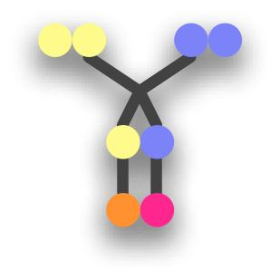
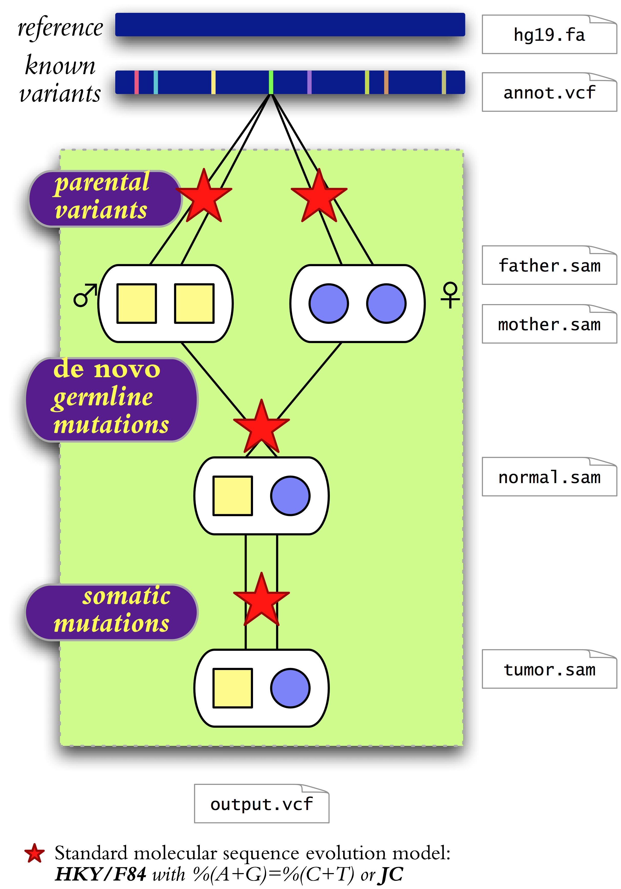

# ***QuadGT*** 

<h1>Introduction</h1>

	<h1> </h1>

	<b>QuadGT</b> is a software package for calling single-nucleotide variants 
in four sequenced genomes comprising a normal-tumor pair and the two parents.
Genotypes are inferred using a joint model of parental variant frequencies, 
<em>de novo</em> germline mutations, and somatic mutations.  
The model quantifies the descent-by-modification relationships between the unknown genotypes
by using a set of parameters in a Bayesian inference setting.

Note that you can use QuadGT on any subset of the four related genomes, 
including parent-offspring trios, and normal-tumor pairs 
without parental samples.  

The software package assumes a thorough probabilistic model 
of single-nucleotide variants 
with the following notable features.

<ul>
<li><strong>Multiple alleles.</strong> 
	Every locus has four possible alleles (A,C,G,T).
	Diploid genotypes combine multi-allele frequencies with adjusted 
	heterozygous/homozygous SNP ratios.  
	</li>
<li><strong>DNA mutation models.</strong> 
	Point mutations between related genomes follow 
	<a href="http://en.wikipedia.org/wiki/Models_of_DNA_evolution">standard DNA evolution models</a>. 
	The implemented models include the 
	basic Jukes-Cantor model  
	and a version of the Hasegawa-Kishino-Yano 
	(a.k.a. Felsenstein's F84) model with 
	purine-pyrimidine balance %(A+G)=%(C+T)=50%	
	and four parameters that adjust sequence divergence, 
	transition/transversion ratio and nucleotide composition (GC-content and 
	amino/keto %(A+C)/%(T+G) content). 		
</li>
<li><strong>Known variants.</strong>
	QuadGT integrates prior information on 
	minor allele frequencies from a chosen  
	variant database such as the 
	NHLBI Exome Sequencing Project's 
	<a href="http://evs.gs.washington.edu/">Exome Variant Server</a>.</li>
<li><strong>Inheritance.</strong> 
	Inheritance models span 
	autosomes, sex chromosomes, and mitochondrial DNA.
	<em>De novo</em> mutations follow a DNA substitution model.
	</li>
<li><strong>Basecall qualities.</strong> 
	QuadGT's model incorporates alignment quality scores,
	uses them in inference, and automatically 
	recalibrates <var>score</var>&rarr;<var>probability</var>
	mappings during model training. 
	</li>
<li><strong>Tumor purity.</strong>
	QuadGT infers tumor purity (normal-tumor sample mixture coefficient) 
	from basecall statistics at somatic mutations, 
	and takes it into account during variant calls. </li>
</ul>

<h1 style="clear:both;">Availability</h1>

<h2>Requirements</h2>

QuadGT is implemented in 64-bit Java, 
and thus works on diverse platforms including Mac OS X, Microsoft Windows, 
and Unix/Linux flavors. 
The software is packaged in a JAR file (<a href="./QuadGT.jar"><tt>QuadGT.jar</tt></a>) 
and can be executed in Java versions 1.6 and above. 

<h2>Installation</h2>  

Download the JAR file <a href="./QuadGT.jar"><tt>QuadGT.jar</tt></a>.
If you want to work with BAM input files, then you also need the 
<a href="http://picard.sourceforge.net">Picard/SAMTools</a> JDK (version 1.85). 
The simplest is to download <a href="QuadGT.zip"><tt>QuadGT.zip</tt></a>
which bundles <code>QuadGT.jar</code> with the SAMTools library. 
(Specifically, <tt>QuadGT.zip</tt> contains <code>dist/QuadGT.jar</code> and <code>dist/lib/samtools-1.85.jar</code>,
as well as the User's Guide <code>dist/quadgt-usage.pdf</code>.)

<h1>Using QuadGT</h1>
<h2>User's Guide</h2>

The User's Guide is available in PDF format
as <a href="./quadgt-usage.pdf">quadgt-usage.pdf</a>.
It gives detailed information about command-line options, 
discusses the mathematical background, 
and provides some advice on designing variant-calling pipelines. 

<h2>Plug and play</h2>

There is a built-in wizard that helps you 
set up then proper command-line options through a 
graphical interface. Execute QuadGT.jar 
with no arguments to launch the wizard. 

<pre>
% java -jar QuadGT.jar &amp; 
</pre>

<h1>Acknowledgements</h1>

The QuadGT software package was developed in conjunction with 
a study led by Daniel Sinnett at the 
<a href="http://www.chu-sainte-justine.org/">Sainte-Justine UHC</a> 
<a href="http://www.chu-sainte-justine.org/Recherche/default.aspx">Research Centre</a> (Montr&eacute;al, QC) on pediatric 
acute lymphoblastic leukemia.  
The project has been supported by funds from the 
<a href="http://www.tfri.ca/">Terry Fox Research Institute</a> and the 
<a href="http://www.cihr-irsc.gc.ca">Canadian Institutes for Health Research</a>, 
the 
<a href="http://www.gouverneursdelespoir.com/fr/chaireFKV/bioDrSinnett.php">Fran&ccedil;ois-Karl-Viau Research Chair in Pediatric
Oncogenomics</a>, and the 
<a href="http://www.nserc-crsng.gc.ca">National Science and Engineering Research Council</a>. 

<h1>Authors</h1>

The QuadGT software package was developed by 
Eric Bareke and Mikl&oacute;s Cs&#369;r&ouml;s.

